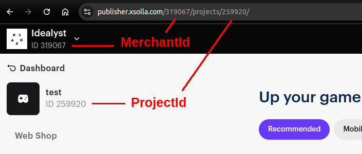
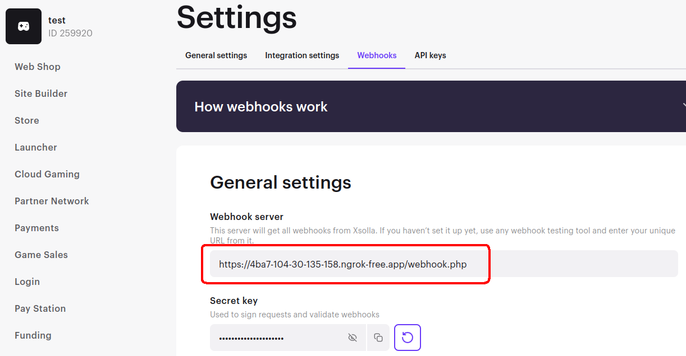

# Xsolla Server-Side Integration Example

This repository provides an example of how to integrate Xsolla PayStation and handle payment processing

## Requirements
- [Docker Compose](https://docs.docker.com/compose/install/)

## Setup Instructions
Video instruction - https://www.youtube.com/watch?v=sFxa2rZvF2Y

### 1. Copy `.env.example` to `.env`
```bash
cp .env.example .env
```
Next, fill in the necessary values in the .env file

Project ID can be found in your Xsolla Publisher Account.


### 2. Start the Docker Containers
```bash
docker-compose --env-file ./.env -f docker/docker-compose.yml up --build
```
The application will be running on http://localhost:8080

### 3. Run Ngrok (optional)
If you don't have public IP and domain, you can use Ngrok to expose your local environment for webhook handling. (you should put your Ngrok auth token to .env before run docker container)

```bash
docker exec -it xsolla_example bash -c 'ngrok http 8080'
```
Ngrok will provide a publicly accessible URL like https://<random\>.ngrok-free.app 

You can open ngrok panel on http://localhost:4040 for looking incoming requests

### 4. Set your webhook handler URL
In you Xsolla Publisher Account -> your project -> Project settings -> Webhooks  
OR open the page: https://publisher.xsolla.com/<YOUR_MERCHANT>/projects/<YOUR_PROJECT>/edit/webhooks/

Your should set your webhook handler URL. 
In this example its will be:  
https://<your\>.ngrok-free.app/**webhook.php**



### 5. Create a product in Publisher Account
In your Xsolla Publisher Account -> your project -> store -> virtual items -> add item
OR open the page: https://publisher.xsolla.com/<YOUR_MERCHANT>/projects/<YOUR_PROJECT>/storefront/virtual-items
and create a product.

### 6. Make a test payment
Open example UI: http://localhost:8080 and edit json data for get token (set sku of project, user id, etc.)

Payment process:
1. as server: create a token by your json data
2. as client: open payment page with your token
3. as server: receive a webhook for validate user
4. as client: make a payment
5. as server: receive a webhook of payment result and provide a customer with a product


## Client Side Integration
Differences: 
 * server side: you keep your projectId, ApiKey on server side + generate json for payments on your server.
 * client side: authorization user on client side + generate json for payments on client side.

### 7. Create login project
In your Xsolla Publisher Account -> your project -> Login -> New login project
Or open the page: https://publisher.xsolla.com/<YOUR_MERCHANT>/projects/<YOUR_PROJECT>/login

And copy your Login ID to .env

### 8. Make a test payment
And open http://localhost:8080/client-side.php

Payment process:
1. as client: push button "Auth" -> login -> for get auth token (field "User token" will be filled)
2. as game-client: generate json data for payment -> redirect client to payment page
3. server: receive a webhook for validate user
4. as client: make a payment
5. server: receive a webhook of payment result and provide a customer with a product 